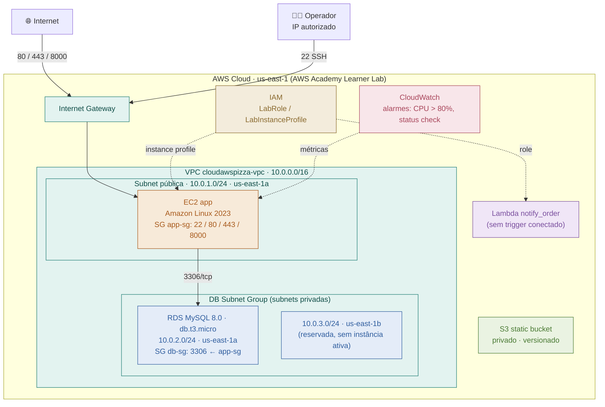

# Arquitetura — Fase 4 (Infraestrutura)

Diagrama gerado a partir do Terraform deste diretório: um `main.tf` raiz orquestrando 7 módulos (`iam`, `vpc`, `ec2`, `rds`, `s3`, `cloudwatch`, `lambda`), provisionados na conta **AWS Academy Learner Lab** (`us-east-1`).

## Legenda

| Cor | Camada | Recursos |
|---|---|---|
| 🟢 Verde-água | Rede | VPC, subnets, Internet Gateway, rotas |
| 🟠 Âmbar | Computação | EC2 |
| 🔵 Azul | Dados | RDS |
| 🟩 Verde | Armazenamento | S3 |
| 🟣 Roxo | Serverless | Lambda |
| 🌸 Rosa | Observabilidade | CloudWatch |
| 🟡 Bronze | IAM / Segurança | LabRole, Security Groups |

Linha sólida = tráfego de rede permitido (SG/rota). Linha pontilhada = associação IAM ou observabilidade (sem rota de rede).

## Notas de arquitetura

- **DB Subnet Group = subnets privadas.** Não é um tipo de rede próprio: é o agrupamento lógico (`aws_db_subnet_group`) das duas subnets privadas do módulo VPC, exigido pelo RDS (mínimo 2 AZs para suportar failover), mesmo com `multi_az = false` hoje.
- **Sem NAT Gateway.** As subnets privadas não têm rota de saída à internet — o RDS não precisa de acesso externo, e isso evita o custo de um NAT Gateway (fora do escopo Free Tier deste case study).
- **IAM reaproveitado.** A conta AWS Academy bloqueia a criação de roles/policies IAM customizadas; por isso EC2 e Lambda reutilizam a `LabRole`/`LabInstanceProfile` já provisionadas, em vez do escopo mínimo recomendado em produção.
- **Lambda sem trigger.** `notify_order` está provisionada e pronta, mas nenhum evento (SNS/EventBridge/SQS) a invoca ainda — o handler documenta essa integração como próximo passo.
- **S3 desacoplado.** O bucket estático está seguro (privado, versionado), mas nenhum outro módulo o referencia no código atual.
- **Postura de demonstração.** RDS single-AZ, backup de 1 dia, `skip_final_snapshot` e `deletion_protection` desligados — adequado ao case study, não a produção.

## Módulos Terraform

| Módulo | Caminho | Provisiona |
|---|---|---|
| iam | `modules/iam` | Data sources para LabRole / LabInstanceProfile |
| vpc | `modules/vpc` | VPC, Internet Gateway, 1 subnet pública, 2 subnets privadas, route tables |
| ec2 | `modules/ec2` | Instância da aplicação, security group `app-sg` |
| rds | `modules/rds` | MySQL 8.0, subnet group, security group `db-sg`, senha aleatória |
| s3 | `modules/s3` | Bucket estático privado e versionado |
| cloudwatch | `modules/cloudwatch` | 2 alarmes de métricas na instância EC2 |
| lambda | `modules/lambda` | Função `notify_order` (Python 3.12, role `LabRole`) |
